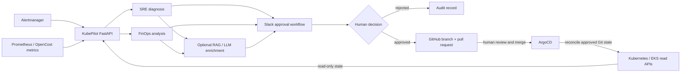

# KubePilot

KubePilot is an AI-assisted SRE and FinOps platform for Kubernetes. It combines deterministic diagnosis, cost analysis, optional RAG/LLM enrichment, signed human approval, and controlled GitHub pull request creation without giving the application direct write access to production clusters.

The project is built around one boundary: KubePilot may observe and recommend, but delivery remains `Git -> pull request -> human merge -> ArgoCD -> Kubernetes`.

## Architecture



There is intentionally no KubePilot-to-Kubernetes write path. The Kubernetes integration permits only `get`, `describe`, and `logs` operations.

## Main Features

- FastAPI endpoints for alerts, approvals, FinOps analysis, LLM analysis, health, and metrics
- Deterministic SRE diagnosis for common pod failures such as `OOMKilled`, `ImagePullBackOff`, and readiness failures
- FinOps utilization analysis, waste detection, rightsizing proposals, and GitOps manifest diffs
- Optional local RAG context and explicitly gated Amazon Bedrock enrichment
- Slack notifications and HMAC-verified interactive approvals
- Allowlisted GitHub branch, file, commit, and pull request execution
- Idempotent approval processing and audit records
- ArgoCD delivery of approved Git state to Online Boutique
- Prometheus-compatible application metrics and an importable Grafana dashboard
- Trivy filesystem and IaC scanning in CI
- CEL-based Kyverno `ValidatingPolicy` manifests in audit-only mode

## SRE Flow

1. Alertmanager sends a payload to `POST /alerts`.
2. KubePilot resolves the workload against a server-side GitOps target allowlist.
3. Read-only Kubernetes and metrics data feed deterministic diagnosis.
4. RAG/LLM analysis may enrich the recommendation but cannot authorize or perform a write.
5. KubePilot prepares a candidate manifest change in memory and sends a Slack approval request.
6. A verified human decision is recorded.
7. An approved change can enter the explicitly gated GitHub execution path.
8. KubePilot creates a branch and pull request but never merges it.
9. After human merge, ArgoCD reconciles the committed state.

See [SRE GitHub PR execution](docs/sre-github-execution.md) and the [Slack approval workflow](docs/slack-approval-workflow.md).

## FinOps Flow

1. KubePilot reads OpenCost or collected Kubernetes utilization data.
2. CPU and memory utilization are evaluated together to avoid unsafe recommendations.
3. Waste candidates are mapped to allowlisted GitOps manifests.
4. KubePilot proposes resource requests and limits without changing files or workloads.
5. A human approves or rejects the recommendation.
6. The approved manifest is rendered in memory and passed through Git and GitHub safety gateways.
7. Any live GitHub write still requires `KUBEPILOT_GITHUB_LIVE_AUTHORIZED=true`.
8. A human merges the resulting pull request before ArgoCD can apply it.

Real EKS validation samples and their limitations are documented in [FinOps EKS evidence](docs/evidence/finops/README.md).

## Slack Approval

Slack callbacks arrive at `POST /slack/actions`. KubePilot verifies the Slack signature and timestamp before parsing the action, derives reviewer identity from the signed payload, and loads trusted remediation state by opaque identifier. User-supplied repository names, branches, paths, or YAML are not trusted.

Dry-run is the default. Repeated identical decisions are idempotent, conflicting terminal decisions are rejected, and no callback can auto-merge a pull request or fall back to direct cluster mutation.

## GitOps Safety Model

The safety controls are layered:

- Kubernetes commands are restricted to read-only operations.
- Workload target files and GitHub repositories are allowlisted.
- Human approval is mandatory for remediation.
- GitHub live execution is disabled unless explicitly enabled at runtime.
- SRE branches use `fix/sre-*`; FinOps branches use `fix/finops-*`.
- Pull requests are never auto-merged.
- External GitHub failures do not trigger a Kubernetes fallback.
- ArgoCD is the only component responsible for reconciling approved Git changes.
- AWS creation or deletion remains outside the application and requires separate operator approval.

## Observability

`GET /metrics` exposes these in-memory Prometheus counters:

- `kubepilot_incidents_total`
- `kubepilot_approvals_total`
- `kubepilot_rejections_total`
- `kubepilot_prs_created_total`
- `kubepilot_github_execution_failures_total`
- `kubepilot_slack_callbacks_total`
- `kubepilot_llm_requests_total`

The Grafana dashboard is in [dashboards/kubepilot-operations.json](dashboards/kubepilot-operations.json), with usage notes in [dashboards/README.md](dashboards/README.md). Prometheus must scrape KubePilot's `/metrics` endpoint. The current EKS lab does not have enough spare pod capacity for an additional observability stack, so these components are not deployed by this project finalization work.

## Security

- Trivy scans the filesystem and infrastructure configuration in [.github/workflows/trivy.yml](.github/workflows/trivy.yml).
- Slack callbacks use signature and replay-window verification.
- Bedrock and GitHub network operations require explicit runtime authorization.
- Secrets are read from environment variables and must not be committed or logged.
- Audit-only CEL policies are under [gitops/security/kyverno](gitops/security/kyverno/README.md).
- The policy bundle reports missing resource controls, privileged containers, `hostPath`, root execution, and privilege escalation without mutating or rejecting resources.

## AWS And EKS

The lab infrastructure in [infrastructure/terraform/eks](infrastructure/terraform/eks) defines:

- Region `eu-west-3`
- EKS cluster `kubepilot-eks-dev`
- Kubernetes 1.33
- Three fixed `t3.small` managed nodes
- A two-AZ VPC using public worker subnets to avoid NAT Gateway cost
- Project, environment, and Terraform ownership tags

This is a constrained demonstration environment, not a production sizing recommendation. Review [cost guidance](docs/costs.md) before running or extending it.

## Repository Layout

```text
agent/                         FastAPI app, SRE/FinOps logic, integrations, tests
dashboards/                    Grafana dashboard and usage notes
docs/                          Workflows, evidence, costs, and demo runbook
gitops/apps/                   Online Boutique base and overlays
gitops/argocd/                 ArgoCD application manifests
gitops/monitoring/             Local observability values and alert rules
gitops/security/kyverno/       Audit-only CEL validation policies
infrastructure/terraform/eks/  AWS VPC and EKS infrastructure
scripts/                       Validation, cost inspection, and guarded cleanup
```

## Local Development

Prerequisites:

- Python 3.11 or newer
- A virtual environment containing the project runtime and test dependencies
- `kubectl`, Terraform, and AWS CLI only for the workflows that need them

The repository does not currently include a pinned Python dependency lock file. Use an isolated environment and record dependency versions before production packaging.

The default LLM provider is local and deterministic. No Bedrock request is made unless both the provider and live authorization are explicitly configured.

Start the API locally:

```bash
python -m uvicorn agent.webhook.app:app --reload
```

Check the local endpoints:

```bash
curl http://127.0.0.1:8000/health
curl http://127.0.0.1:8000/metrics
```

Keep live execution disabled during development:

```bash
export KUBEPILOT_LLM_PROVIDER=mock
export KUBEPILOT_GITHUB_LIVE_AUTHORIZED=false
```

Never place `GITHUB_TOKEN`, `SLACK_SIGNING_SECRET`, `SLACK_WEBHOOK_URL`, or AWS credentials in source control.

## Testing

Run the non-integration suite:

```bash
python -m pytest -m "not integration" -q
```

The current baseline is `432 passed, 4 deselected, 2 known dependency deprecation warnings`. Integration tests require explicitly prepared Kubernetes or Prometheus environments and are not part of the default command.

Useful static checks:

```bash
python -m compileall agent
python -m json.tool dashboards/kubepilot-operations.json
kubectl kustomize gitops/security/kyverno > /dev/null
git diff --check
```

## Demo

The reproducible sequence and screenshot checklist are in [docs/demo-runbook.md](docs/demo-runbook.md). The demo covers EKS and ArgoCD health, Online Boutique, SRE diagnosis and approval, the guarded PR path, real FinOps evidence, metrics, the Grafana dashboard, audit-only Kyverno policies, and Trivy CI.

## Current Limitations

- Metrics and the demo approval repository are in memory and reset on process restart.
- Multiple API replicas expose separate counters; the dashboard aggregates active series.
- Real FinOps evidence uses a short observation window and is not sufficient for production rightsizing.
- OpenCost, Prometheus, Grafana, and Kyverno are prepared but are not deployed to the capacity-constrained EKS lab.
- Bedrock and GitHub live paths depend on external credentials and remain disabled by default.
- The Python environment is not yet represented by a pinned dependency manifest.
- The public EKS API allowlist and lab networking must be reassessed before any non-lab use.
- Cleanup remains an operator-controlled Terraform workflow and is never initiated by KubePilot.
